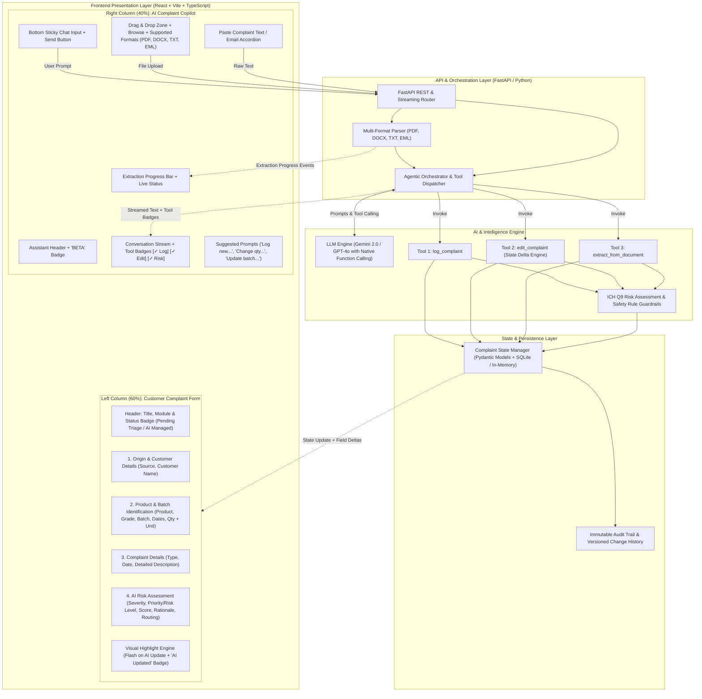

# PharmaCopilot — Technical Architecture Specification

## 1. Executive Summary & Core Philosophy

**PharmaCopilot** is an enterprise-grade, AI-powered customer complaint management system built specifically for pharmaceutical manufacturing and quality operations (featuring an **ICH Q9–informed risk assessment** and **designed with auditability principles inspired by 21 CFR Part 11**).

The platform transforms unstructured natural-language complaints and diverse customer documentation (PDFs, scanned reports, DOCX, TXT, EML emails) into fully structured, auditable complaint records and automated risk assessments.

### Fundamental Architectural Tenet: The Zero-Manual-Edit Form
In traditional enterprise systems, users navigate cumbersome multi-tab forms with dozens of text fields, dropdowns, and datepickers. In PharmaCopilot:
1. **The Complaint Form is Strictly Read-Only (A Living Visual Projection):** Form fields look and feel like authentic enterprise inputs (with clinical borders, labels, and icons) but are completely read-only/disabled. Users are physically and programmatically prevented from typing into or editing form fields.
2. **Natural Language is the Exclusive Control Plane:** All mutations—field population, corrections, deletions, batch updates, and document ingestions—occur through natural-language prompts processed by the AI Copilot.
3. **Deterministic State Synchronization:** Every interaction preserves unchanged data, computes field deltas, re-evaluates risk when necessary, and appends to an immutable audit trail.
4. **Primary Focus on Core Workflows:** To ensure high reliability, development is strictly centered on the three mandatory workflows: **Log Complaint**, **Edit Complaint**, and **Document Extraction** before enabling auxiliary bonus tools.

---

## 2. System Architecture Overview

PharmaCopilot employs a modern, decoupled client-server architecture designed for enterprise reliability, sub-second reactivity, strict schema validation, and modular AI tool execution.



---

## 3. Technology Stack Justification

| Layer | Recommended Technology | Architectural Justification |
| :--- | :--- | :--- |
| **Frontend Framework** | **React 18+ / Vite + TypeScript** | High-performance rendering, strong type safety, instant hot-module reload, modular component tree. |
| **Styling & Design System** | **Tailwind CSS + Lucide Icons** | Clean clinical palette (slate/white/blue/indigo/amber/emerald), rounded cards (`rounded-xl`), subtle borders (`border-slate-200`), accessible typography (Inter). |
| **Frontend State Management** | **Zustand** | Lightweight, reactive centralized state store connecting AI tool response payloads directly to read-only form fields and highlight triggers. |
| **Backend Framework** | **Python 3.11+ / FastAPI** | High performance, native async support, seamless integration with AI SDKs and document processing libraries. |
| **Data Validation & Schemas**| **Pydantic v2** | Ultra-fast validation, automatic JSON schema generation for LLM Function Calling tools. |
| **AI / LLM Orchestration** | **Google Gemini 2.0 Flash / Pro (or OpenAI GPT-4o)** | Native multimodal parsing, deterministic function calling, ultra-low latency. |
| **Document Ingestion** | **pdfplumber + python-docx + email parser** | Native support for PDF, DOCX, TXT, and EML formats with high textual and metadata fidelity. |
| **Persistence** | **SQLite / In-Memory Store** | Reliable, zero-configuration persistence with session isolation and audit trail logging. |

---

## 4. Frontend Architecture & Layout Specification

### 4.1 Split-Screen Layout (Inspired by Reference UI)

The user interface implements an enterprise-grade two-column split-screen layout:
* **Left Column (~60% width):** Structured Customer Complaint Form.
* **Right Column (~40% width):** AI Complaint Copilot with Document Intake & Chat.

```
+-------------------------------------------------------------------------------------------------------------------------------+
|                                                PHARMACOPILOT - AI QUALITY ASSURANCE                                            |
+-----------------------------------------------------------------------+-------------------------------------------------------+
|  LEFT COLUMN (~60%): CUSTOMER COMPLAINT FORM [READ-ONLY / AI-MANAGED]  |  RIGHT COLUMN (~40%): AI COMPLAINT COPILOT            |
+-----------------------------------------------------------------------+-------------------------------------------------------+
|  Log Customer Complaint                          [Pending Triage]     |  ✨ AI Complaint Intake Assistant             [BETA]  |
|  API & FDF Quality Assurance Module             🔒 AI Managed Form    |                                                       |
|                                                                       |  ┌ - - - - - - - - - - - - - - - - - - - - - - - - ┐  |
|  1. ORIGIN & CUSTOMER DETAILS                                         |  |   ☁ Drag & drop complaint document here         |  |
|  ┌───────────────────────────┐ ┌───────────────────────────┐          |  |     or click to browse                          |  |
|  │ Complaint Source          │ │ Customer Name             │          |  └ - - - - - - - - - - - - - - - - - - - - - - - - ┘  |
|  │ [Awaiting AI extraction...]│ │ [Awaiting AI extraction...]│          |  ----------------------- OR ------------------------  |
|  └───────────────────────────┘ └───────────────────────────┘          |  [ 📄 Paste Complaint Text / Email                ]  |
|                                                                       |  ┌─────────────────────────────────────────────────┐  |
|  2. PRODUCT & BATCH IDENTIFICATION                                    |  │ ℹ Supported: PDF, DOCX, TXT, EML | Max: 10MB    │  |
|  ┌───────────────────────────┐ ┌───────────────────────────┐          |  └─────────────────────────────────────────────────┘  |
|  │ Product Name              │ │ Product Strength/Grade    │          |                                                       |
|  │ [Epinephrine Injection    ]│ │ [1 mg/mL, USP            ]│          |  EXTRACTION PROGRESS                                  |
|  └───────────────────────────┘ └───────────────────────────┘          |  [████████████████████░░░░░░░░░░░░░░░░░░░░] 45%      |
|  ┌───────────────────────────┐ ┌───────────────────────────┐          |  Analyzing document content and extracting details... |
|  │ Batch/Lot Number          │ │ Manufacturing Date    📅  │          |                                                       |
|  │ [B24017                   ]│ │ [2025-10-15              ]│          |  AI ASSISTANT CONVERSATION                            |
|  └───────────────────────────┘ └───────────────────────────┘          |  ┌─────────────────────────────────────────────────┐  |
|  ┌───────────────────────────┐ ┌───────────────────────────┐          |  │ 🤖 Upload a complaint document or paste text    │  |
|  │ Expiry Date           📅  │ │ Quantity Affected      [kg]│         |  │    above. I will extract details & populate.    │  |
|  │ [2027-10-14               ]│ │ [50                      ]│         |  └─────────────────────────────────────────────────┘  |
|  └───────────────────────────┘ └───────────────────────────┘          |  ┌─────────────────────────────────────────────────┐  |
|                                                                       |  │ 👤 Change the affected quantity to 75 units     │  |
|  3. COMPLAINT DETAILS                                                 |  └─────────────────────────────────────────────────┘  |
|  ┌───────────────────────────┐ ┌───────────────────────────┐          |  [✓ edit_complaint: updated affected_quantity]        |
|  │ Complaint Type            │ │ Complaint Date        📅  │          |  [✓ Risk Assessment: Recalculated]                    |
|  │ [Container Closure Leakage]│ │ [2026-03-10              ]│          |  ┌─────────────────────────────────────────────────┐  |
|  └───────────────────────────┘ └───────────────────────────┘          |  │ 🤖 Updated quantity to 75 units. Preserved batch│  |
|  ┌─────────────────────────────────────────────────────────┐          |  │    B24017 and updated the risk calculation.     │  |
|  │ Detailed Complaint Description                          │          |  └─────────────────────────────────────────────────┘  |
|  │ [50 units of Epinephrine Injection showed leakage around│          |                                                       |
|  │  neck during hospital unpackaging...]                   │          |  SUGGESTED PROMPTS                                    |
|  └─────────────────────────────────────────────────────────┘          |  [ "Log a new complaint" ] [ "Change affected qty" ]  |
|                                                                       |  [ "Update batch number" ] [ "Explain risk score"  ]  |
|  4. AI RISK ASSESSMENT                                                |                                                       |
|  ┌───────────────────────────┐ ┌───────────────────────────┐          |  ┌───────────────────────────────────────────────┬─┐  |
|  │ Initial Severity          │ │ Priority / Risk Level     │          |  │ Ask me anything about this complaint...       │✈│  |
|  │ [HIGH (Sterility Breach) ▼]│ │ [P1 - Critical Action  ▼]│          |  └───────────────────────────────────────────────┴─┘  |
|  └───────────────────────────┘ └───────────────────────────┘          |  AI responses may contain errors. Please verify info. |
|  - Rationale: Loss of container closure integrity in injectables.     |                                                       |
|  - Routing: QA Quality Assurance & Sterile Manufacturing Line 2       |                                                       |
|  - Actions: Immediate batch quarantine; reserve sample sterility check|                                                       |
+-----------------------------------------------------------------------+-------------------------------------------------------+
```

---

### 4.2 Left Column: Customer Complaint Form Details

The left column strictly mirrors the structure and aesthetic of the reference UI, organized into 4 distinct sections with enterprise clinical styling:

#### Section 1: Origin & Customer Details
* **Complaint Source:** Disabled form control (e.g. `Hospital Pharmacovigilance`, `Retail Customer`, `Distributor`).
* **Customer Name:** Disabled form control (e.g. `St. Jude Memorial Hospital`).

#### Section 2: Product & Batch Identification
* **Product Name:** Disabled input with clear pharmaceutical styling.
* **Product Strength/Grade:** Disabled input (e.g., `500 mg`, `1 mg/mL`, `USP Grade`).
* **Batch/Lot Number:** Disabled input with monospace font styling for lot tracking.
* **Manufacturing Date:** Disabled input with right-aligned calendar icon.
* **Expiry Date:** Disabled input with right-aligned calendar icon.
* **Quantity Affected:** Disabled input paired with integrated unit selector/badge (e.g., `kg`, `units`, `vials`, `packs`).

#### Section 3: Complaint Details
* **Complaint Type:** Disabled input/select styling (e.g., `Packaging Defect`, `Particulate Matter`, `Labeling Error`).
* **Complaint Date:** Disabled input with calendar icon.
* **Detailed Complaint Description:** Full-width disabled multi-line textarea with subtle inner shadow.

#### Section 4: AI Risk Assessment
* **Initial Severity:** Displayed in a styled select-like box with severity color chip (e.g., `Critical`, `High`, `Medium`, `Low`).
* **Priority / Risk Level:** Displayed in a styled select-like box (e.g., `P1 - Immediate`, `P2 - Standard`, `P3 - Low`).
* **Risk Score & Quantitative Matrix:** Calculated score (e.g., `18 / 25`).
* **Risk Rationale:** Clinical reasoning explaining the assessment based on patient safety and regulatory compliance.
* **Recommended Actions & Routing:** Action tags indicating target departments (e.g., `Quality Assurance`, `Regulatory Affairs`) and mandatory responses (e.g., `Batch Quarantine`, `Reserve Sample Testing`).

---

### 4.3 Zero-Manual-Edit Form Implementation & Visual Feedback

To strictly satisfy the core requirement that **users must not manually fill or edit the complaint form**:

1. **Disabled/Read-Only Input Controls:**
   - Every field uses custom components: `<ReadOnlyInput>`, `<ReadOnlyDateInput>`, `<ReadOnlySelect>`, and `<ReadOnlyTextarea>`.
   - Each field is styled with standard form borders (`border-slate-300`), white/off-white backgrounds (`bg-slate-50/70`), clear label typography (`text-xs font-semibold text-slate-600`), and placeholder text (`Awaiting AI extraction...`).
   - Native inputs have `readOnly={true}`, `tabIndex={-1}`, and cursor styling `cursor-default select-all`.
   - Form fields include a subtle header lock badge: `🔒 AI Managed`.

2. **Visual Highlight Engine (Flash on AI Mutation):**
   - When an AI tool updates or populates a field, that field triggers a **2.5-second visual pulse**:
     - Light blue/indigo border ring glow (`ring-2 ring-indigo-400 bg-indigo-50/30 transition-all duration-500`).
     - A transient badge appears above the field: `AI Updated` or `AI Populated`.
     - When an existing value changes (e.g., `Quantity: 50 → 75`), the field displays the transition cleanly.

3. **Absence of Manual Save / Edit Controls:**
   - There are **no manual "Save Complaint" or "Edit" buttons** that allow user data overrides.
   - The form displays an indicator: `🔒 Synchronized via AI Copilot`.

---

### 4.4 Right Column: AI Complaint Copilot Details

The right column matches the reference screenshot's "AI Complaint Intake Assistant":

1. **Header & Badge:**
   - Sparkle icon + Title: **AI Complaint Intake Assistant** (or **AI Complaint Copilot**).
   - Blue pill badge: **BETA**.
2. **Document Ingestion Hub:**
   - **Dashed Drag & Drop Dropzone:** "Drag & drop complaint document here or click to browse".
   - **Supported File Types Banner:** Light-green banner with info icon: `Supported formats: PDF, DOCX, TXT, EML | Max file size: 10MB`.
   - **"OR" Separator & Paste Option:** Collapsible "Paste Complaint Text / Email" button allowing direct clipboard entry.
3. **Extraction Progress Indicator:**
   - Animated progress bar showing real-time extraction states (0% → 35% reading text → 75% running AI extraction → 100% populating form).
   - Descriptive status text: *"Analyzing document content and extracting key details... Please wait, this may take a few moments."*
4. **AI Assistant Conversation Stream:**
   - Conversational message bubbles for user instructions and AI responses.
   - Initial welcome bubble guiding the user on how to begin.
   - **AI Activity & Tool Execution Badges:** Compact visual chips embedded directly in assistant messages:
     - `[✓ Log Complaint]`
     - `[✓ Risk Assessment]`
     - `[✓ Updated affected_quantity: 50 → 75]`
     - `[✓ Preserved: Batch B24017, Product Epinephrine]`
5. **Suggested Prompts (Quick Chips):**
   - Clickable prompt chips for rapid interaction:
     - `"Log a new complaint"`
     - `"Change the affected quantity"`
     - `"Update the batch number"`
     - `"Check complaint completeness"`
     - `"Summarize this complaint"`
6. **Chat Input & Action Controls:**
   - Sticky bottom input field: `"Ask me anything about this complaint..."`.
   - Send button with send icon (paper plane).
   - Small footer caption: *"AI responses may contain errors. Please verify information."*

---

## 5. Detailed Component Hierarchy

The frontend follows a clean, modular component structure:

```
frontend/src/
├── App.tsx                                   # Main split-screen container (60% Form / 40% Copilot)
├── main.tsx                                  # React DOM entry point
├── types/
│   ├── complaint.ts                          # TypeScript interfaces for Complaint, Risk, and Delta
│   ├── chat.ts                               # Message types, Tool execution badges, and attachments
│   └── document.ts                           # Document extraction states and progress types
├── store/
│   ├── useComplaintStore.ts                  # Central Zustand store (Complaint state, deltas, highlights)
│   └── useChatStore.ts                       # Chat messages, pending states, extraction progress
├── components/
│   ├── layout/
│   │   ├── Header.tsx                        # Enterprise top navbar with logo and environment badge
│   │   └── SplitScreenLayout.tsx             # Two-column grid container (60% left / 40% right)
│   ├── form/                                 # Left side (~60%): Read-only complaint form
│   │   ├── ComplaintFormContainer.tsx        # Form wrapper, header, and lock status indicators
│   │   ├── FormSectionHeader.tsx             # Numbered section header component (1., 2., 3., 4.)
│   │   ├── sections/
│   │   │   ├── OriginCustomerSection.tsx     # Section 1: Complaint Source & Customer Name
│   │   │   ├── ProductBatchSection.tsx       # Section 2: Product, Grade, Batch, Dates, Quantity
│   │   │   ├── ComplaintDetailsSection.tsx   # Section 3: Type, Date, Detailed Description
│   │   │   └── RiskAssessmentSection.tsx     # Section 4: Severity, Priority, Score, Rationale, Routing
│   │   └── controls/                         # Custom disabled/read-only input components
│   │       ├── ReadOnlyInput.tsx             # Styled read-only text input with highlight pulse
│   │       ├── ReadOnlyDateInput.tsx         # Styled read-only date input with calendar icon
│   │       ├── ReadOnlyTextarea.tsx          # Styled read-only multi-line textarea
│   │       ├── ReadOnlySelect.tsx            # Styled read-only select/dropdown appearance
│   │       └── FieldHighlightBadge.tsx       # "AI Updated" / "AI Populated" animated pill
│   └── copilot/                              # Right side (~40%): AI Copilot & Document Hub
│       ├── CopilotContainer.tsx              # Copilot wrapper & sticky layout
│       ├── CopilotHeader.tsx                 # Header with title and BETA badge
│       ├── document/
│       │   ├── DocumentDropzone.tsx          # Drag-and-drop zone with file picker
│       │   ├── SupportedFormatsCard.tsx      # Green info pill: PDF, DOCX, TXT, EML
│       │   ├── PasteTextModal.tsx            # Paste complaint text/email modal or collapsible
│       │   └── ExtractionProgressBar.tsx     # Animated progress bar and status caption
│       ├── chat/
│       │   ├── ChatMessageList.tsx           # Scrollable message area with bot & user avatars
│       │   ├── ChatMessageItem.tsx           # Individual message bubble
│       │   ├── ToolExecutionBadge.tsx        # [✓ Tool Name] activity chips
│       │   ├── SuggestedPrompts.tsx          # Clickable prompt pills
│       │   └── ChatInputBar.tsx              # Input box, send button, and disclaimer caption
│       └── common/
│           ├── StatusBadge.tsx               # Status pills (Pending Triage, Under Review)
│           └── Spinner.tsx                   # Loading indicator
└── styles/
    └── index.css                             # Tailwind CSS setup and clinical design system tokens
```

---

## 6. The Three Core Workflows & State Synchronization

PharmaCopilot prioritizes the three mandatory workflows with zero manual form interaction:

```mermaid
sequenceDiagram
    autonumber
    actor User as Quality Specialist
    participant Copilot as AI Copilot Panel (Right 40%)
    participant Agent as Backend Agent & Tools
    participant Risk as ICH Q9 Risk Engine
    participant Store as Central Complaint Store
    participant Form as Complaint Form (Left 60%)

    %% Workflow 1: Log Complaint
    rect rgb(240, 248, 255)
    Note over User, Form: Workflow 1: Log Complaint via Natural Language
    User->>Copilot: Types: "Received complaint for Epinephrine Inj 1mg/mL, batch B24017, 50 units leaking."
    Copilot->>Agent: POST /api/chat { message, session_id }
    Agent->>Agent: Model calls `log_complaint` tool
    Agent->>Risk: Execute ICH Q9 Risk Assessment
    Risk-->>Agent: Severity: HIGH, Priority: P1, Routing: QA Sterile Ops
    Agent-->>Copilot: Return tool badges [✓ log_complaint] [✓ Risk Assessment] + Chat Response
    Agent->>Store: Dispatch new ComplaintRecord
    Store->>Form: Populate all form fields with visual flash animation
    Form-->>User: Displays populated form with "AI Populated" badges
    end

    %% Workflow 2: Edit Complaint
    rect rgb(255, 250, 240)
    Note over User, Form: Workflow 2: Edit Complaint with Field Preservation
    User->>Copilot: Types: "Actually, the affected quantity is 75 units."
    Copilot->>Agent: POST /api/chat { message, session_id }
    Agent->>Agent: Model calls `edit_complaint` tool with delta { affected_quantity: 75 }
    Agent->>Agent: Preserves Product (Epinephrine) & Batch (B24017) untouched
    Agent->>Risk: Recalculate Risk (75 units)
    Agent-->>Copilot: Return tool badges [✓ Updated affected_quantity] [✓ Risk Assessment]
    Agent->>Store: Dispatch State Delta { affected_quantity: 75 }
    Store->>Form: Update ONLY Affected Quantity field
    Form-->>User: Affected Quantity field glows indigo with "AI Updated: 50 → 75"
    end

    %% Workflow 3: Document Extraction
    rect rgb(240, 255, 240)
    Note over User, Form: Workflow 3: Document Upload & Extraction
    User->>Copilot: Drops "Customer_Complaint_Letter.pdf" into dropzone
    Copilot->>Copilot: Show Extraction Progress Bar (0% → 100%)
    Copilot->>Agent: POST /api/documents/upload (Multipart file)
    Agent->>Agent: Multi-format parser extracts text and tables
    Agent->>Agent: Model calls `extract_from_document` tool
    Agent->>Risk: Calculate Risk Assessment
    Agent-->>Copilot: Finish progress bar; post summary message + tool badges
    Agent->>Store: Hydrate Complaint Record
    Store->>Form: Populate all fields and display active record
    Form-->>User: Form populated directly from document data
    end
```

---

## 7. Backend & AI Integration Architecture

### 7.1 Backend Modular Service Architecture
```
backend/
├── app/
│   ├── main.py                     # FastAPI application factory and route registration
│   ├── config.py                   # Environment configuration (API keys, CORS, file limits)
│   ├── models/
│   │   ├── complaint.py            # Pydantic schemas for Complaint, Risk, and Audit
│   │   └── api.py                  # Request / response payload models
│   ├── services/
│   │   ├── agent.py                # LLM orchestrator & function-calling loop
│   │   ├── llm.py                  # Gemini / OpenAI API integration
│   │   ├── tools.py                # Implementations of log_complaint, edit_complaint, extract_from_document
│   │   ├── risk_engine.py          # ICH Q9 Risk Matrix & pharmaceutical safety guardrails
│   │   └── document_parser.py      # Multi-format document parser (PDF, DOCX, TXT, EML)
│   └── store/
│       └── state_store.py          # Session-based state store and audit trail logger
├── requirements.txt                # Python dependencies
└── tests/                          # Backend unit & integration tests
```

### 7.2 Tool Function Signatures

#### 1. `log_complaint`
Accepts unstructured complaint descriptions, extracts structured pharmaceutical fields, and populates the initial record:
```json
{
  "name": "log_complaint",
  "description": "Logs a new pharmaceutical complaint from natural language and initializes the form state and risk assessment.",
  "parameters": {
    "type": "object",
    "properties": {
      "complaint_source": { "type": "string" },
      "customer_name": { "type": "string" },
      "product_name": { "type": "string" },
      "product_grade_strength": { "type": "string" },
      "batch_number": { "type": "string" },
      "manufacturing_date": { "type": "string", "format": "date" },
      "expiry_date": { "type": "string", "format": "date" },
      "affected_quantity": { "type": "integer" },
      "unit_of_measure": { "type": "string", "default": "units" },
      "complaint_type": { "type": "string" },
      "complaint_date": { "type": "string", "format": "date" },
      "complaint_description": { "type": "string" }
    },
    "required": ["complaint_description"]
  }
}
```

#### 2. `edit_complaint`
Updates only the requested fields while strictly preserving all existing fields:
```json
{
  "name": "edit_complaint",
  "description": "Applies a partial update to the active complaint. Only specified fields are mutated; all other fields remain strictly preserved.",
  "parameters": {
    "type": "object",
    "properties": {
      "updated_fields": {
        "type": "object",
        "description": "Key-value map containing only the specific fields that the user requested to change.",
        "properties": {
          "complaint_source": { "type": "string" },
          "customer_name": { "type": "string" },
          "product_name": { "type": "string" },
          "product_grade_strength": { "type": "string" },
          "batch_number": { "type": "string" },
          "manufacturing_date": { "type": "string" },
          "expiry_date": { "type": "string" },
          "affected_quantity": { "type": "integer" },
          "unit_of_measure": { "type": "string" },
          "complaint_type": { "type": "string" },
          "complaint_date": { "type": "string" },
          "complaint_description": { "type": "string" }
        }
      },
      "edit_rationale": { "type": "string", "description": "Brief explanation of what was changed and why" }
    },
    "required": ["updated_fields"]
  }
}
```

#### 3. `extract_from_document`
Parses extracted text from uploaded documents (PDF, DOCX, TXT, EML) into structured complaint records:
```json
{
  "name": "extract_from_document",
  "description": "Extracts structured pharmaceutical complaint attributes from document contents and maps them into the complaint form schema.",
  "parameters": {
    "type": "object",
    "properties": {
      "extracted_data": {
        "type": "object",
        "description": "Structured data extracted from the uploaded document",
        "properties": {
          "complaint_source": { "type": "string" },
          "customer_name": { "type": "string" },
          "product_name": { "type": "string" },
          "product_grade_strength": { "type": "string" },
          "batch_number": { "type": "string" },
          "manufacturing_date": { "type": "string" },
          "expiry_date": { "type": "string" },
          "affected_quantity": { "type": "integer" },
          "unit_of_measure": { "type": "string" },
          "complaint_type": { "type": "string" },
          "complaint_date": { "type": "string" },
          "complaint_description": { "type": "string" }
        }
      },
      "document_summary": { "type": "string", "description": "Brief summary of the document source and contents" }
    },
    "required": ["extracted_data"]
  }
}
```

---

## 8. Summary of Updates Aligned with Reference UI

| Architectural Element | Previous Draft | Updated Specification (Aligned with Reference UI) |
| :--- | :--- | :--- |
| **Split-Screen Ratio** | 42% Left (Chat) / 58% Right (Form) | **60% Left (Complaint Form) / 40% Right (AI Copilot)** |
| **Form Fields Appearance** | Generic display cards / key-value list | **Authentic form input styling (read-only/disabled), borders, icons, placeholders** |
| **Form Sections** | 3 broad cards | **4 distinct numbered sections: Origin & Customer, Product & Batch, Complaint Details, AI Risk Assessment** |
| **Document Upload Hub** | Standalone tab / drawer | **Integrated top dropzone with dashed border, browse button, paste accordion, and supported formats banner** |
| **Supported File Formats** | PDF, images | **PDF, DOCX, TXT, EML (up to 10MB)** |
| **Extraction Feedback** | Spinner only | **Extraction Progress Bar with live percentage and descriptive status updates** |
| **AI Activity Visibility** | Thought stream | **Embedded tool badges in chat: `[✓ Log Complaint]`, `[✓ Risk Assessment]`, `[✓ Updated affected_quantity]`** |
| **Field Change Feedback** | Subtle background pulse | **Field highlight ring with animated "AI Updated" / "AI Populated" badges and value transition indicators** |
| **Scope Management** | Mentioned 6 bonus features | **Strictly focused on the 3 core workflows first: Log Complaint, Edit Complaint, Document Extraction** |
