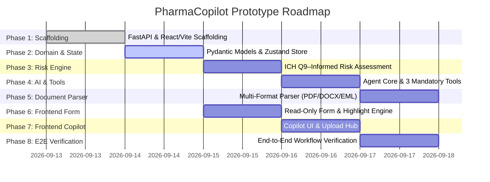

# PharmaCopilot — Prototype Implementation Plan

This implementation plan translates the technical architecture defined in [`docs/architecture.md`](file:///c:/PharmaCopilot/docs/architecture.md) into concrete, streamlined development phases for a functional prototype. It focuses on delivering an elegant pharmaceutical complaint management prototype with strict adherence to the **zero-manual-edit form model**, featuring an **ICH Q9–informed risk assessment** and **designed with auditability principles inspired by 21 CFR Part 11**.

---

## 1. Prototype Scope & Guiding Principles

1. **Zero Manual Editing**: The complaint form fields are strictly read-only display controls. No direct form editing controls or mutation endpoints exist.
2. **Simplified Prototype Architecture**:
   - Lightweight **in-memory session state store** in FastAPI (avoiding complex database migrations for the prototype).
   - Direct LLM integration (Google Gemini / OpenAI) paired with an instant **offline mock fallback** for reliable, deterministic testing.
   - Clean, lightweight React + Vite + TypeScript frontend with Tailwind CSS.
3. **Core Scope Focused**: Strictly prioritized around the three mandatory workflows:
   - **Workflow 1**: Natural-language complaint logging (`log_complaint`)
   - **Workflow 2**: Natural-language complaint editing (`edit_complaint`) with data preservation
   - **Workflow 3**: Multi-format document extraction (`extract_from_document`)
4. **Visual Fidelity**: Faithful implementation of the reference layout ([`assets/reference-image.png`](file:///c:/PharmaCopilot/assets/reference-image.png)): 60% Form on Left, 40% Copilot on Right, visual highlight pulses on AI mutations, and tool execution badges in chat.

---

## 2. Streamlined Phase Matrix



---

## Phase 1: Prototype Scaffolding & Environment Setup

### Objective
Set up a clean, lightweight monorepo structure with a Python FastAPI backend and a React/TypeScript Vite frontend.

### Tasks
- [ ] **Backend Setup (`backend/`)**:
  - Python virtual environment with minimal dependencies:
    - `fastapi`, `uvicorn[standard]`
    - `pydantic>=2.5.0`
    - `google-genai` (or `google-generativeai`), `openai`
    - `pdfplumber`, `pypdf`, `python-docx`
    - `python-multipart`
  - Base FastAPI app with CORS middleware and health check (`GET /api/health`).
- [ ] **Frontend Setup (`frontend/`)**:
  - React 18+ TypeScript app initialized via Vite.
  - Dependencies: `zustand` (state store), `lucide-react` (icons), `tailwindcss`.
  - Tailwind CSS configured for a clean clinical palette (slate, indigo, blue, emerald, amber).

### Deliverables
- Backend running on `http://localhost:8000` with `/api/health`.
- Frontend running on `http://localhost:5173` rendering a base split-screen shell.

---

## Phase 2: Domain Models & In-Memory State Store

### Objective
Define the complaint schema, delta structures, and a lightweight in-memory store designed with auditability principles inspired by 21 CFR Part 11.

### Tasks
- [ ] **Pydantic Models (`backend/app/models/complaint.py`)**:
  - `ProductDetails`: `product_name`, `product_grade_strength`.
  - `ManufacturingDetails`: `batch_number`, `manufacturing_date`, `expiry_date`, `affected_quantity`, `unit_of_measure`.
  - `ComplaintDetails`: `complaint_source`, `customer_name`, `complaint_type`, `complaint_date`, `complaint_description`.
  - `RiskAssessment`: `severity` (Critical, High, Medium, Low), `priority` (P1, P2, P3, P4), `risk_score`, `reasoning`, `recommended_actions`, `target_routing`.
  - `AuditEntry`: `timestamp`, `trigger_source`, `user_prompt`, `field_changes`.
  - `ComplaintRecord`: Aggregated record with unique `id` and `complaint_number`.
- [ ] **In-Memory State Store (`backend/app/store/state_store.py`)**:
  - Simple dictionary-backed session store: `get_complaint()`, `create_complaint()`, `apply_delta()`.
  - Computes and logs field changes into the audit list upon every edit.
- [ ] **Frontend TypeScript Store (`frontend/src/store/useComplaintStore.ts`)**:
  - Central Zustand store holding `complaint`, `highlights`, `isAiProcessing`.
  - `syncFromAgentResponse()` helper to atomically update form state and trigger highlight animations.

### Deliverables
- Unit-tested Pydantic models.
- Zustand store ready to receive state updates and trigger visual pulses.

---

## Phase 3: ICH Q9–Informed Risk Assessment Engine

### Objective
Implement the deterministic risk matrix and pharmaceutical safety guardrails to evaluate complaint severity, priority, and routing according to ICH Q9 principles.

### Tasks
- [ ] **Risk Matrix Calculator (`backend/app/services/risk_engine.py`)**:
  - Evaluate:
    - **Severity ($S \in 1..5$)**: Impact on patient safety and product quality.
    - **Probability ($P \in 1..5$)**: Likelihood of recurrence in batch.
    - **Detectability ($D \in 1..5$)**: Likelihood of detection before administration.
    - **Risk Priority Number**: $\text{RPN} = S \times P \times D$.
  - Classifications:
    - `CRITICAL` ($RPN \ge 60$ or Sterile Override) $\rightarrow$ Priority `P1 - Immediate Action`.
    - `HIGH` ($30 \le RPN < 60$) $\rightarrow$ Priority `P2 - Urgent Investigation`.
    - `MEDIUM` ($12 \le RPN < 30$) $\rightarrow$ Priority `P3 - Standard Evaluation`.
    - `LOW` ($RPN < 12$) $\rightarrow$ Priority `P4 - Trend Monitoring`.
- [ ] **Pharmaceutical Safety Guardrails**:
  - Clamp severity to `CRITICAL` if sterile/injectable breach (particulate, leakage, vial fracture).
  - Generate standard recommended actions (Quarantine, Reserve sample check, QA review).
  - Departmental routing (e.g., `Quality Assurance & Sterile Ops`).

### Deliverables
- Tested `RiskEngine.evaluate(complaint_data)` producing explainable risk outputs.

---

## Phase 4: Core AI Tools & Agent Service

### Objective
Implement the AI orchestrator with native function calling for the three mandatory tools, supported by an offline mock fallback for rapid prototype testing.

### Tasks
- [ ] **Tool 1: `log_complaint` (`backend/app/services/tools.py`)**:
  - Extracts fields from raw natural language.
  - Automatically runs `RiskEngine.evaluate()`.
  - Creates and stores new `ComplaintRecord`.
- [ ] **Tool 2: `edit_complaint` (State Delta Engine)**:
  - Takes `updated_fields` from user instructions.
  - Applies a partial patch to the active complaint, preserving all untouched fields.
  - Checks if changed fields impact risk (e.g. quantity or severity changes) and recalculates risk accordingly.
- [ ] **Tool 3: `extract_from_document`**:
  - Takes extracted document text.
  - Populates structured complaint fields and generates initial risk assessment.
- [ ] **Agent Service (`backend/app/services/agent.py`)**:
  - Dispatches tool calls via Google Gemini / OpenAI with function calling.
  - Includes a deterministic mock mode that executes regex/heuristic extraction when API keys are absent.
  - Returns tool execution badges (`[✓ Log Complaint]`, `[✓ Updated affected_quantity: 50 → 75]`).

### Deliverables
- `POST /api/chat` endpoint returning conversational responses, tool badges, and updated state.

---

## Phase 5: Multi-Format Document Ingestion Pipeline

### Objective
Enable document ingestion supporting PDF, DOCX, TXT, and EML files (up to 10MB).

### Tasks
- [ ] **Parser Implementation (`backend/app/services/document_parser.py`)**:
  - `PDF`: Extract text via `pdfplumber` (fallback to `pypdf`).
  - `DOCX`: Extract paragraphs and tables using `python-docx`.
  - `EML`: Extract headers (From, Subject, Date) and body text using standard `email` library.
  - `TXT`: Direct text reading with whitespace normalization.
- [ ] **Upload Endpoint (`POST /api/documents/upload`)**:
  - Accepts multipart file upload, validates format and size (< 10MB).
  - Extracts text and passes it to `extract_from_document` tool.
  - Returns extraction progress status and hydrated complaint state.
- [ ] **Paste Endpoint (`POST /api/documents/paste`)**:
  - Quick endpoint for directly pasted email or complaint text.

### Deliverables
- Functional upload endpoint tested with sample PDF, DOCX, TXT, and EML files.

---

## Phase 6: Frontend — Read-Only Complaint Form (Left 60%)

### Objective
Build the structured customer complaint form UI matching the reference layout ([`assets/reference-image.png`](file:///c:/PharmaCopilot/assets/reference-image.png)), ensuring users cannot manually edit fields.

### Tasks
- [ ] **Form Container & Section Layout (`frontend/src/components/form/`)**:
  - Clean white cards with subtle borders (`border-slate-200`) and rounded corners (`rounded-xl`).
  - Header: "Log Customer Complaint", "API & FDF Quality Assurance Module", "Pending Triage" badge, "🔒 AI Managed Form" badge.
- [ ] **The 4 Form Sections**:
  1. **Origin & Customer Details**: Complaint Source, Customer Name.
  2. **Product & Batch Identification**: Product Name, Product Strength/Grade, Batch/Lot Number, Manufacturing Date (calendar icon), Expiry Date (calendar icon), Quantity Affected (with unit badge e.g. `kg` or `units`).
  3. **Complaint Details**: Complaint Type, Complaint Date, Detailed Complaint Description (textarea look).
  4. **AI Risk Assessment**: Initial Severity (colored badge), Priority / Risk Level, Risk Score, Rationale, Recommended Actions, Routing.
- [ ] **Read-Only Input Controls (`controls/ReadOnlyInput.tsx`, etc.)**:
  - Standard form input appearance (borders, labels, placeholder "Awaiting AI extraction...").
  - Strictly non-editable: `readOnly={true}`, `tabIndex={-1}`, `cursor-default`.
  - Zero manual Save / Edit buttons.
- [ ] **Visual Highlight Pulse Engine (`FieldHighlightBadge.tsx`)**:
  - When AI updates a field, the field triggers an indigo glow pulse (`ring-2 ring-indigo-400 bg-indigo-50/40`) for 2.5 seconds.
  - A subtle `"AI Updated"` or `"AI Populated"` pill appears above the field.

### Deliverables
- Read-only form component matching reference styling with working highlight animations.

---

## Phase 7: Frontend — AI Complaint Copilot (Right 40%)

### Objective
Create the conversational intake assistant matching the reference UI, wired to chat and document upload endpoints.

### Tasks
- [ ] **Copilot Header**:
  - Sparkle icon + "AI Complaint Intake Assistant" + "BETA" pill badge.
- [ ] **Document Upload Hub (`DocumentDropzone.tsx`)**:
  - Dashed dropzone: *"Drag & drop complaint document here or click to browse"*.
  - File picker for `.pdf`, `.docx`, `.txt`, `.eml`.
  - "OR" divider and "Paste Complaint Text / Email" button.
  - Info banner: `Supported formats: PDF, DOCX, TXT, EML | Max file size: 10MB`.
- [ ] **Extraction Progress Indicator (`ExtractionProgressBar.tsx`)**:
  - Progress bar animating during document analysis (0% → 100%) with status description.
- [ ] **Chat Conversation Area (`ChatMessageList.tsx`)**:
  - AI welcome message explaining the workflow.
  - User prompts and AI responses.
  - **Tool Activity Badges**: Embedded chips like `[✓ Log Complaint]`, `[✓ Updated affected_quantity: 50 → 75]`, `[✓ Risk Assessment]`.
- [ ] **Suggested Prompts (`SuggestedPrompts.tsx`)**:
  - Clickable chips: `"Log a new complaint"`, `"Change affected quantity"`, `"Update batch number"`.
- [ ] **Sticky Chat Input Bar (`ChatInputBar.tsx`)**:
  - Input field: *"Ask me anything about this complaint..."* with send button.
  - Compliance footer: *"AI responses may contain errors. Please verify information."*

### Deliverables
- Interactive Copilot panel matching the reference screenshot.

---

## Phase 8: End-to-End Workflow Verification

### Objective
Validate that the complete prototype works seamlessly across all three mandatory workflows and respects the zero-manual-edit constraint.

### Tasks
- [ ] **Workflow 1 Verification (Log Complaint)**:
  - Enter: *"Customer reports 50 vials of Epinephrine 1mg/mL Batch B24017 leaking around seal."*
  - Verify AI executes `log_complaint`.
  - Verify form fields populate and flash with `"AI Populated"`.
  - Verify risk assessment is calculated (`HIGH` severity, sterile breach rationale).
- [ ] **Workflow 2 Verification (Edit Complaint & Data Preservation)**:
  - Enter: *"Actually, the affected quantity is 75 units, not 50."*
  - Verify AI executes `edit_complaint` with delta `{ affected_quantity: 75 }`.
  - Verify only `Quantity Affected` changes and flashes with `"AI Updated"`.
  - Verify Product, Batch, Dates, and Description remain unchanged.
  - Verify risk assessment is updated.
- [ ] **Workflow 3 Verification (Document Upload & Modification)**:
  - Upload a sample PDF complaint.
  - Verify progress bar animates and form populates from document data.
  - Enter follow-up edit: *"The batch number is actually B24099."*
  - Verify seamless natural-language edit after document extraction.
- [ ] **Zero-Manual-Edit Verification**:
  - Confirm user cannot type or modify any form field directly.
  - Confirm absence of manual Save/Edit buttons.

### Deliverables
- Fully working prototype fulfilling all problem statement requirements.

---

## 3. Simplified Project File Structure

```
PharmaCopilot/
├── docs/
│   ├── ProblemStatement.md             # Challenge specification
│   ├── architecture.md                # System architecture
│   └── implementation.md              # Streamlined prototype plan
├── sample_data/
│   ├── sample_complaint_letter.pdf    # Test PDF complaint
│   ├── sample_email_complaint.eml     # Test EML email
│   └── sample_packaging_defect.docx   # Test DOCX report
├── backend/
│   ├── app/
│   │   ├── main.py                    # FastAPI entry & routes
│   │   ├── config.py                  # Settings
│   │   ├── models/
│   │   │   └── complaint.py           # Pydantic models (Complaint, Risk, Audit)
│   │   ├── services/
│   │   │   ├── agent.py               # AI Orchestrator & Tool dispatcher
│   │   │   ├── llm.py                 # Gemini / OpenAI & mock fallback
│   │   │   ├── tools.py               # log_complaint, edit_complaint, extract_from_document
│   │   │   ├── risk_engine.py         # ICH Q9–informed risk assessment & guardrails
│   │   │   └── document_parser.py     # PDF, DOCX, TXT, EML parser
│   │   └── store/
│   │       └── state_store.py         # In-memory session store & audit logging
│   ├── requirements.txt
│   └── test_prototype.py              # Automated test for the 3 workflows
└── frontend/
    ├── package.json
    ├── tsconfig.json
    ├── vite.config.ts
    ├── tailwind.config.js
    └── src/
        ├── App.tsx                    # Two-column layout (60% Form / 40% Copilot)
        ├── main.tsx
        ├── types/
        │   └── complaint.ts           # TypeScript interfaces
        ├── store/
        │   └── useComplaintStore.ts   # Zustand state store
        ├── components/
        │   ├── form/                  # Left Column (~60%)
        │   │   ├── ComplaintFormContainer.tsx
        │   │   ├── OriginCustomerSection.tsx
        │   │   ├── ProductBatchSection.tsx
        │   │   ├── ComplaintDetailsSection.tsx
        │   │   ├── RiskAssessmentSection.tsx
        │   │   └── ReadOnlyField.tsx  # Styled disabled input with highlight pulse
        │   └── copilot/               # Right Column (~40%)
        │       ├── CopilotContainer.tsx
        │       ├── DocumentDropzone.tsx
        │       ├── ExtractionProgressBar.tsx
        │       ├── ChatMessageList.tsx
        │       ├── ToolBadge.tsx
        │       ├── SuggestedPrompts.tsx
        │       └── ChatInputBar.tsx
        └── styles/
            └── index.css              # Clinical design tokens
```

---

## 4. Prototype Verification Checklist

| Requirement | Prototype Verification | Success Criteria |
| :--- | :--- | :--- |
| **Zero Manual Editing** | Code inspection & UI test | Form fields render as read-only/disabled; no manual save/edit controls exist; user typing is blocked. |
| **Tool 1: Log Complaint** | Chat prompt verification | Natural language populates form and generates an **ICH Q9–informed risk assessment**. |
| **Tool 2: Edit Complaint** | Partial update verification | Modifying quantity updates only that field, preserves all other fields, and updates risk if needed. |
| **Tool 3: Document Extraction** | Document upload verification | Uploading PDF/DOCX/TXT/EML animates progress, populates form, and enables follow-up chat editing. |
| **Visual Highlight Pulse** | UI interaction observation | Modified fields briefly flash with an indigo ring and display an `"AI Updated"` badge for 2.5 seconds. |
| **Regulatory Phrasing** | Repository text audit | Uses **“ICH Q9–informed risk assessment”** and **“Designed with auditability principles inspired by 21 CFR Part 11”**. |
