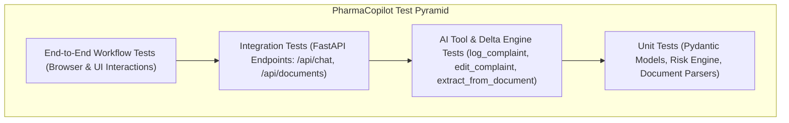

# PharmaCopilot — Test Plan & Quality Assurance Matrix

This document outlines the testing strategy for the PharmaCopilot prototype, defining unit, integration, tool-specific, and end-to-end verification suites to ensure reliability across all three mandatory workflows and regulatory design principles.

---

## 1. Test Architecture Overview



---

## 2. Unit Testing Suite (`backend/tests/`)

### 2.1 Pydantic Model Validation (`test_models.py`)
- [ ] **Valid Complaint Creation**: Instantiate `ComplaintRecord` with valid ISO dates, quantities, and verify successful serialization.
- [ ] **Optional Field Gracefulness**: Verify that records serialize cleanly when optional fields (`customer_name`, `manufacturing_date`, `expiry_date`) are `None`.
- [ ] **Audit Trail Structure**: Verify that every state transition generates a valid `AuditEntry` with timestamp, user prompt, and field diff.

### 2.2 ICH Q9–Informed Risk Assessment Engine (`test_risk_engine.py`)
- [ ] **Standard Calculation**: Verify $RPN = S \times P \times D$ computes expected numerical score and maps correctly to `LOW`, `MEDIUM`, `HIGH`, or `CRITICAL`.
- [ ] **Sterile Product Override**: Verify that an injectable product with a leak or particulate defect is automatically clamped to `CRITICAL` / Priority `P1`, regardless of affected quantity.
- [ ] **Departmental Routing**: Verify routing assignments (e.g., `Quality Assurance & Sterile Ops` for sterility issues, `Packaging Engineering` for labeling defects).

### 2.3 Document Parsers (`test_document_parser.py`)
- [ ] **PDF Parser**: Verify text and table extraction from a digital sample PDF (`sample_complaint_letter.pdf`).
- [ ] **DOCX Parser**: Verify text extraction from sample Word document (`sample_packaging_defect.docx`).
- [ ] **EML Parser**: Verify subject, sender email, date, and body extraction from sample RFC 822 email (`sample_email_complaint.eml`).
- [ ] **TXT Parser**: Verify clean text normalization.
- [ ] **Size Guardrail**: Verify files $> 10\text{MB}$ raise a `ValueError` or HTTP 400.

---

## 3. Tool & Delta Engine Tests (`test_agent_tools.py`)

### 3.1 Tool 1: `log_complaint`
- [ ] Natural-language prompt is converted into structured fields.
- [ ] Initial risk assessment is automatically triggered and attached to the state.
- [ ] Returns structured response packet containing tool badge `[✓ Log Complaint]`.

### 3.2 Tool 2: `edit_complaint` (State Preservation Engine)
- [ ] **Targeted Mutation**: Starting with `{ product: "Epinephrine", batch: "B24017", quantity: 50 }`, an edit prompt *"Change quantity to 75"* updates **only** `quantity` to 75.
- [ ] **Data Preservation**: Verify `product` ("Epinephrine") and `batch` ("B24017") remain strictly unchanged.
- [ ] **Risk Recalculation**: Verify risk score updates when a risk-bearing field changes.
- [ ] **Non-Risk Mutation**: Verify risk score remains unchanged when an unimpactful field (e.g. `customer_name`) changes.

### 3.3 Tool 3: `extract_from_document`
- [ ] Extracted text is mapped to complaint schema and hydrates active complaint state.
- [ ] Chat session memory is updated so subsequent natural language queries modify the extracted state.

---

## 4. Integration API Tests (`test_api.py`)

| Endpoint | Method | Test Case Description | Expected Result |
| :--- | :--- | :--- | :--- |
| `/api/health` | `GET` | Health check verification | `200 OK`, `{ "status": "healthy" }` |
| `/api/chat` | `POST` | Initial complaint submission via natural language | `200 OK`, returns assistant message, tool badges, and populated state |
| `/api/chat` | `POST` | Follow-up edit instruction | `200 OK`, returns delta, updated state, and preserved fields |
| `/api/documents/upload` | `POST` | Multipart PDF upload | `200 OK`, returns extraction progress, summary, and populated form state |
| `/api/documents/upload` | `POST` | Unsupported file extension (.exe, .zip) | `400 Bad Request`, descriptive error |
| `/api/complaints/active`| `GET` | Fetch active complaint and audit log | `200 OK`, returns current complaint and version history |

---

## 5. End-to-End Workflow Verification Matrix

### Workflow 1: Log Complaint
1. User types: *"50 vials of Epinephrine 1mg/mL Batch B24017 found leaking."*
2. Verify AI response includes tool activity badge `[✓ Log Complaint]`.
3. Verify Left Form displays populated Product, Batch, Quantity, and Description.
4. Verify Risk Assessment displays `HIGH` or `CRITICAL` with sterile breach rationale.
5. Verify fields trigger an `"AI Populated"` visual highlight pulse.

### Workflow 2: Edit Complaint & Preservation
1. User types: *"Actually, the affected quantity is 75 units."*
2. Verify AI response includes badge `[✓ Updated affected_quantity: 50 → 75]`.
3. Verify Left Form updates **only** `Quantity Affected`.
4. Verify Product ("Epinephrine") and Batch ("B24017") remain unchanged.
5. Verify `Quantity Affected` flashes with an `"AI Updated"` badge for 2.5 seconds.

### Workflow 3: Document Extraction & Chat Continuation
1. User drops `sample_complaint_letter.pdf` into dropzone.
2. Verify Extraction Progress Bar animates (0% to 100%).
3. Verify Form populates with extracted hospital and product data.
4. User types: *"The customer reported 2 additional defective packs."*
5. Verify Copilot updates the quantity and description without resetting the form.

### Workflow 4: Zero-Manual-Edit Enforcement
1. Attempt to type inside `<input>` and `<textarea>` fields $\rightarrow$ Verify text cursor is disabled and no characters are entered.
2. Verify absence of manual "Save", "Submit", or "Edit" buttons on the form.
3. Verify `🔒 AI Managed Form` badge is visible.

---

## 6. Test Execution Commands

```bash
# Backend Unit & Integration Tests
cd backend
pytest tests/ -v

# Run with test coverage
pytest --cov=app tests/

# Frontend Unit & Component Tests
cd frontend
npm run test

# End-to-End Workflow Smoke Test
python backend/test_prototype.py
```
